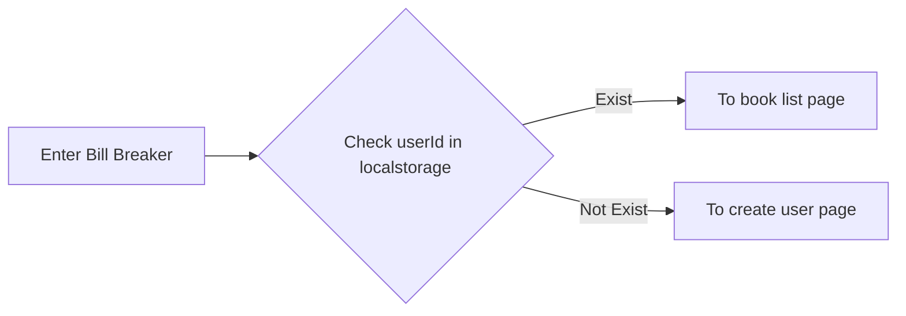

# Bill Breaker

## Overview

**Bill Breaker** help you easily solves the trouble of splitting money with your friends. Allowing you to focus more on other things.

### Scenario

- Traveling with friends
- Renting house together
- ...etc

## Getting Started

### Start API server

```bash
cd apps/api

# Build docker image
docker build -t tsungyu927/bill-breaker-api .

# Run container with image (& .env file) and expose to 8080 port
docker run --env-file .env -p 8080:8080 -it tsungyu927/bill-breaker-api
```

### Start Web server

```bash
cd apps/web

# Run web using pnpm (5173 port)
pnpm run dev
```

## API

[Swagger](http://localhost:8080/swagger/index.html)

## Features

🚀 Anonymous (Store uuid in localStorage and use it as userId & deviceId)

🚀 Grouping (Create new book)

🚀 Create cost (card)

🚀 Drag & Drop 【cost card】

🚀 Split cost automatically

### Phase 2

🚩 Identity authentication (TBC Line Login、Google…?)

🚩 Support LineBot

🚩 Notification (remind to pay)

🚩 History stats

## User flow


